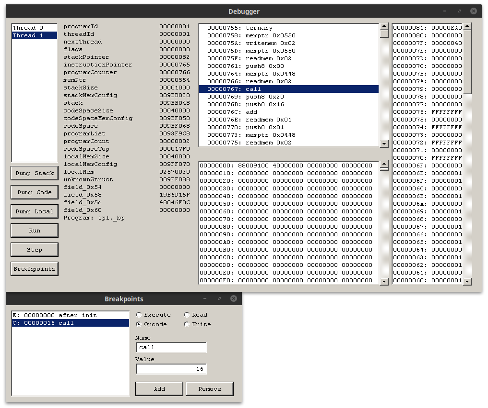

Buriko General Interpreter
==========================

This project aims to reverse-engineer the Ethornell Buriko General Interpreter (BGI), and create an open source re-implementation of the engine.

Currently the goal is to re-implement the engine in C and Javascript.

For now, all reverse-engineering efforts are based on the version of BGI found in the Lump of Sugar visual novels.

This is a clean-room reverse engineering project, and we have no intention of facilitating piracy, therefore no files from any games are included in this repository and must be acquired elsewhere. The downloader script can assist in fetching trial versions of a select few games from official sources.

Technical documentation
-----------------------

You can find technical information about the engine in the `Technical.md` file. Note that this is still a work in progress, and the file will change as we learn more about the engine.

Reimplementation
----------------

The reimplementation work can be found in the `patching` directory (Sorry about the mess! It'll get better, I promise).

How it works is that we inject assembly code into the executable, which loads a DLL that contains our reimplementation and the debugger.

The DLL further patches the engine and redirects opcodes to our reimplemented opcodes.

The strategy is just to implement an opcode, run the game and see if it crashes. It's a pretty crude technique, but it'll work for now.

Milestones reached:
* Reimplemented enough basic opcodes for Tayutama to run.

Debugger
--------

To help reverse-engineering the game, we have created a debugging tool for the engine. After patching the game, the debugger is loaded and allows us to inspect threads, halt the execution and single-step through the program.

On the TODO list for the debugger: Code injection, improved memory viewer & editor.



Help wanted
-----------

Currently, I have no idea what original BGI scripts look like. Eventually we'd like to create a decompiler for the scripts, and knowing what they look like would be very helpful in creating a similar-looking result.

If you have a copy of the development tools, please send Cytlan (`Cytlan#5147` on Discord) a screenshot or two of some code, so that we can get an idea of what we should try to emulate.

Getting started
---------------

Note: I use Linux Mint, so these instructions only apply to Linux. If you use something else, you'll have to figure this out on your own.

Note 2: I assume `python3` is the default python interpreter on your system. It is on mine.

Before you do anything else, you need to install the various tools and dependencies needed:
```sh
apt install build-essential g++-mingw-w64-i686 nasm nodejs
pip install pefile
```

First, you should let execute the download script, so that you can get some data to work with (You only need to do this once):
```sh
cd downloader
npm install # Install dependencies
nodejs downloader.js
cd ..
```

Then you should run the patcher, which takes care of assembling and injecting code, as well as compiling the DLL. Run this command every time you modify any of the C or asm files.
```sh
cd patching
./patch.sh
cd ..
```

Finally, run the game. The debugging window should pop up. Hit the "Run" button to start the game.
```sh
wine downloader/data/tayutama/tayutama.exe
```

For disassembling the executable, I use Ghidra. I'm not sure how to share my Ghidra projects, so it's not included here.

Contact
-------

You can reach me on Discord: `Cytlan#5147`
